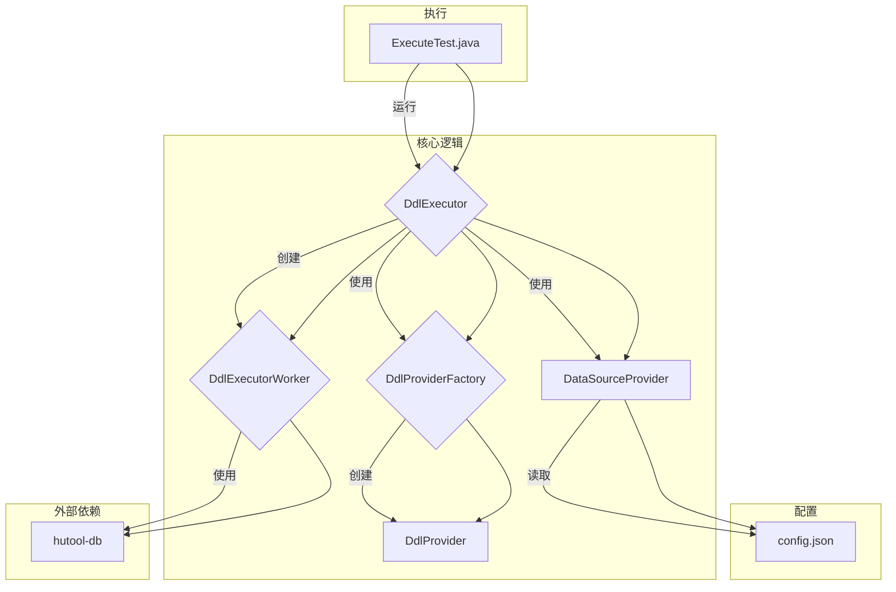

# mysqlToAll

`mysqlToAll` 是一个功能强大且灵活的数据迁移工具，旨在将数据库模式和数据从 MySQL 源同步到各种目标数据库。它使用 Java 构建，并利用 Hutool 库实现其许多核心功能。

## 项目架构

下图说明了 `mysqlToAll` 项目的架构：



## 功能特性

*   **模式同步:** 自动将源 MySQL 数据库的表结构复制到目标数据库。
*   **数据迁移:** 将数据从源数据库传输到目标数据库。
*   **多数据库支持:** 支持多种目标数据库。
*   **并发执行:** 利用多线程方法加快多个表的迁移速度。
*   **灵活配置:** 数据库连接和迁移设置在 `config.json` 文件中进行外部化配置。
*   **可扩展性:** 为每个数据库使用 `DdlProvider`，可以轻松添加对新数据库的支持。

## 支持的数据库

### 源数据库

*   MySQL

### 目标数据库

*   Oracle
*   Microsoft SQL Server
*   Vastbase
*   Kingbase

## 快速入门

### 环境要求

*   Java 8 或更高版本
*   Maven

### 配置

1.  导航到 `src/main/resources/com/haosmart/config/config.json`。
2.  修改 JSON 文件以配置源和目标数据库连接。每个数据库连接都由一个 JSON 对象表示，具有以下属性：
    *   `id`: 配置的唯一标识符。
    *   `dbType`: 数据库的类型 (例如, `mysql`, `oracle`)。
    *   `dbUrl`: 数据库的 JDBC URL。
    *   `userName`: 数据库连接的用户名。
    *   `password`: 数据库连接的密码。
    *   `schemaName`: (可选) 要在目标数据库中使用的模式名称。

### 运行应用

该应用程序通过 JUnit 测试运行。`src/test/java/com/haosmart/mysqltoall/ExecuteTest.java` 中的每个测试方法都预先配置了特定的迁移任务。

1.  打开 `ExecuteTest.java` 文件。
2.  选择与您要执行的迁移相对应的测试方法 (例如, `oracleTableTest` 用于将单个表迁移到 Oracle)。
3.  您可以修改现有测试或创建新测试以满足您的需求。例如，要将所有表同步到 Kingbase，您可以运行 `kingBaseBaseALLTest` 测试。
4.  在您的 IDE 中或使用 Maven 运行测试：

    ```bash
    # 运行单个测试
    mvn test -Dtest=ExecuteTest#kingBaseBaseALLTest
    ```

## 工作原理

主要逻辑由 `DdlExecutor` 类协调。当运行 `ExecuteTest` 中的测试方法时，它会使用源和目标数据库配置实例化 `DdlExecutor`。

然后 `DdlExecutor` 会：
1.  为源数据库和目标数据库创建 `DataSourceProvider` 实例。
2.  使用 `DdlProviderFactory` 获取适用于目标数据库的 `DdlProvider`。
3.  从源数据库中获取表元数据。
4.  将表分配给多个 `DdlExecutorWorker` 线程以进行并发处理。

每个 `DdlExecutorWorker` 负责：
1.  检查目标表是否存在。
2.  如果表不存在或配置了重建，它将删除现有表（如果有）并使用 `DdlProvider` 提供的 DDL 语句创建一个新表。
3.  如果启用了数据迁移，它会以分页的方式将数据从源表传输到目标表。
